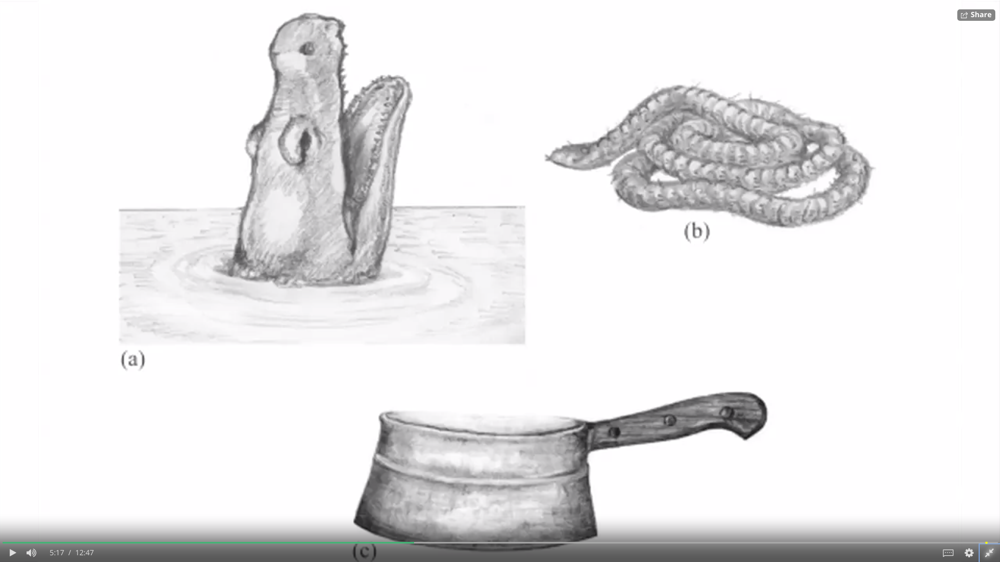

Buddhism and Modern Psychology, Robert Wright
=============================================

These are my personal notes made while/after watching lectures on
Buddhism by Robert Wright.

You can check out the course
[here.](https://www.coursera.org/learn/science-of-meditation)

Video 1: Introduction
=====================

The course will cover naturalistic parts of Buddhism - more
specifically, the ones that can be evaluated scientifically. The focus
will be on western Buddhism, as it typically skips the supernatural
parts, like deities etc. It cannot, however, be said that it is a
secular version of buddhism.

A psychologist, William James, has said that each religion believes in a
kind of unseen order. This is true for even the western outlook on
Buddhism, as it claims that there is an unseen order to the world, a
truth about how things work, that the humand mind was trained not to
see.

The Buddhist claim - the diagnosis - is that by aligning our minds to
these thruths, to this order, we can relieve our suffering. Is that
claim through - that is the topic of this course.

Modern psychology seems to support some of the claims. It seems that
there are some things we do not see, because that's how we were built by
natural selection.

However, it does not mean that it is impossible to change.

What Buddhism proposes are techniques, which make use of the knowledge
of these universal truths to overcome them, to "reprogram" us. (Kind of
like a rebellion against our nature.)

Video 2: Feelings and Illusions
===============================

In this video Robert Wright talks about the outlook on feelings and
emotions from both the buddhist and evolutionist standpoint.

Both philosophies pose a question of "Why do feelings and emotions have
the properties, that they have?"

First, we see a video from Yifa, a buddhist nun from Taiwan, about
meditation. Mr. Wright poses a question: How can meditation change how
you feel?

Yifa explains, that meditating on your sensations can help you to see
their nature more clearly. Your feeling seem real to you, but when you
meditate, you can take a look on them from the inside. When you analyse
your feelings like this, it seems more like watching a movie, like they
are unreal. This helps to distance yourself for them, and see how they
affect you.

While you won't be able to find buddhist texts saying that feelings are
not real, you can instead notice that the general belief is that they
are not a reliable guide to reality, and might be untrustworthy.

By acknowledging that, meditation allows you to distance from them, and
notice how subtly they affect you.

This effect that the feelings have on people was proven experimentally.

Various people were shown the picture you can see below.

As you can notice, the images can be interpreted in multiple ways, for
example the squirel can be an alligator head, and vice-versa.

However, before seeing the picture, the experimentators either played
happy music, none, or scary music for the subjects to hear.

After showing the image for just a second, the people were asked what
they saw. The results were interesting: for an image that could either
be interpreted as a coiled rope or a snake, the people who heard scary
music tended to see a snake.

The happy music did not appear to have such a strong effect.

This phenomenon can be explained by evolutionary psychology quite
easily.

If you, for example, were hiking on a rattlesnake infested terrain, and
have heard a story that someone died of a rattlesnake bite there two
weeks ago, any rustle you would have heard would immediately lead you
think that there must be a rattlesnake somewhere. Only after some
examination you would change you initial reaction.

This makes perfect sense from an evolutionary standpoint, because
"better safe, than sorry". When you think there is a snake, but there
isn't any, you live anyway. When you think there is no snake, but there
is one - the possibility of you dying is very much real.

Even Sophocles noticed this, as evidenced by his quote: "To the man who
is afraid everything rustles."

Therefore, we do not often see clearly, as that is not the goal of
natural selection. Natural selection has one goal only: to pass the
genes to the next generation, to survive. Sometimes, it is more
beneficial to be affected by fear for quicker reactions, which might
lead to saving one's life.

This evidences that brains were not built to see the truth.

Another evidence of evolution leading us not to see things clearly: it
has been proven by modern psychologists, that when hearing something
dangerous coming (like a car on a road), people tend to underestimate
the time it takes for the object in question to get to them.

Because of this, Buddhism postulates that we should be sceptical of our
feelings and thoughts, because they can change our perceptions.

This is why politicians often use fear as a manipulation tactic - it can
very easily change people's perception of, for example, a nation that
the politician wants to go to a war with.

Therefore, it is important to figure out how it all works, so that we
can counteract this effect that emotions can have on us.
